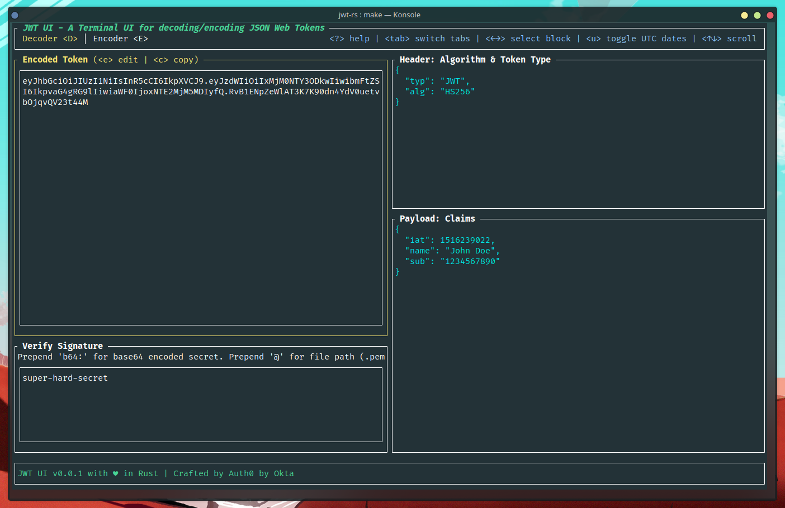
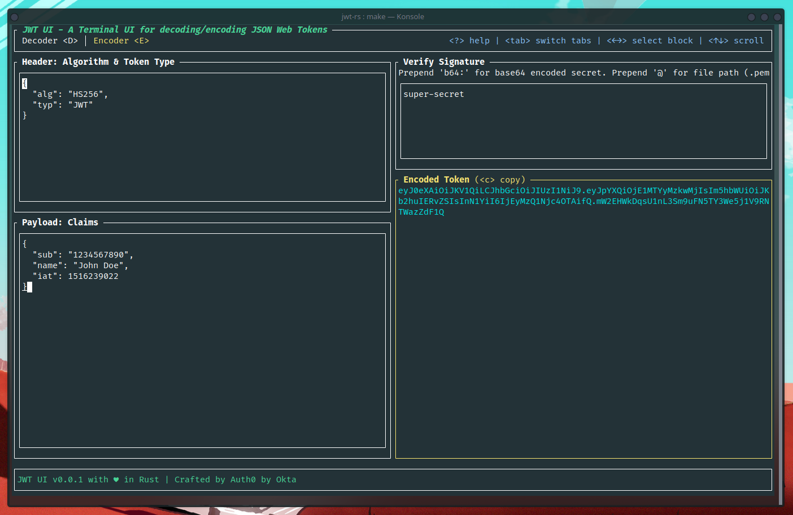
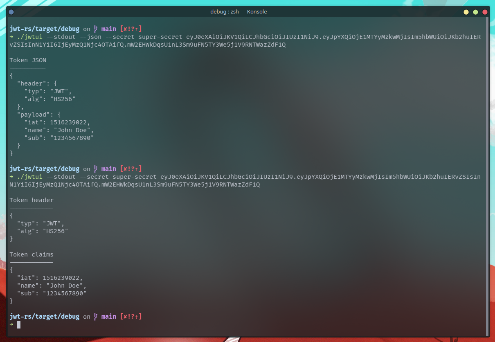

# JWT UI - A Terminal UI for decoding/encoding JSON Web Tokens


[](https://crates.io/crates/jwt-ui)


[](https://coveralls.io/github/jwt-rs/jwt-ui?branch=main)
[](https://github.com/jwt-rs/jwt-ui/releases)


[](https://twitter.com/intent/follow?screen_name=deepu105)

```
     ____.__      _____________       ____ ___.___
    |    /  \    /  \__    ___/      |    |   \   |
    |    \   \/\/   / |    |  ______ |    |   /   |
/\__|    |\        /  |    | /_____/ |    |  /|   |
\________| \__/\  /   |____|         |______/ |___|
                \/
```

A terminal UI for decoding/encoding JSON Web Tokens inspired by [JWT.io](https://jwt.io/) and [jwt-cli](https://github.com/mike-engel/jwt-cli)



Crafted by


## Features

- Fully offline
- Supports secrets as plain text, file path (beginning with `@`) or base64 encoded string (beginning with `b64:`). Supported secret formats:
  - **HMAC** - `HS{256,384,512}`: Plain text, base64 encoded string, JWKS (JSON text and `.json` file)
  - **RSA** - `RS{256,384,512}`, `PS{256,384,512}`: PEM file, DER file, PKCS8 file, JWKS (JSON text and `.json` file)
  - **ECDSA** - `ES{256,384}`: PEM file, DER file, PKCS8 file, JWKS (JSON text and `.json` file)
  - **EdDSA** : PEM file, DER file, PKCS8 file, JWKS (JSON text and `.json` file)
  - - Note: JWKS support is only for decoding. For encoding use PEM/DER/PKCS8 files for RSA/ECDSA/EdDSA and plain/base64 text for HMAC
- Dark/Light themes
- Sensible keyboard shortcuts and Mouse support
- Copy to clipboard
- STDOUT mode

## Installation

### Homebrew (Mac & Linux)

```bash
brew tap jwt-rs/jwt-ui
brew install jwt-ui

# If you need to be more specific, use:
brew install jwt-rs/jwt-ui/jwt-ui
```

To upgrade

```bash
brew upgrade jwt-ui
```

### Scoop (Windows)

```bash
scoop bucket add jwt-ui-bucket https://github.com/jwt-rs/scoop-jwt-ui

scoop install jwt-ui
```

### Cargo

If you have Cargo installed then you install JWT UI from crates.io

```bash
cargo install jwt-ui
```

You can also clone the repo and run `cargo run` or `make` to build and run the app

### Install script

Run the below command to install the latest binary. Run with sudo if you don't have write access to `/usr/local/bin`. Else the script will install to the current directory

```sh
curl https://raw.githubusercontent.com/jwt-rs/jwt-ui/main/deployment/getLatest.sh | bash
```

### Docker

Run JWT UI as a Docker container.

```bash
docker run --rm -it deepu105/jwt-ui
```

You can also clone this repo and run `make docker` to build a docker image locally and run it using the above command

### Manual
Binaries for macOS (x86_64, arm64), Linux GNU/MUSL(x86_64, armv6, armv7, aarch64) and Windows (x86_64, aarch64) are available on the [releases](https://github.com/jwt-rs/jwt-ui/releases) page

1. Download the latest [binary](https://github.com/jwt-rs/jwt-ui/releases) for your OS.
1. For Linux/macOS:
   1. `cd` to the file you just downloaded and run `tar -C /usr/local/bin -xzf downloaded-file-name`. Use sudo if required.
   2. Run with `jwtui`
1. For Windows:
   1. Use 7-Zip or TarTool to unpack the tar file.
   2. Run the executable file `jwtui.exe`

## USAGE:

```shell
# Start UI
jwtui

# Start UI with prefilled token to decode and options
jwtui [OPTIONS] [TOKEN]

# Start UI with prefilled token to decode and JWKS secret from URL
jwtui -S $(curl https://domain.auth0.com/.well-known/jwks.json) [TOKEN]

# Print decoded token to stdout with HMAC plain text secret
jwtui -s -S 'plain_text_secret' [TOKEN]

# Print decoded token to stdout without signature validation.
jwtui -sn [TOKEN]

# Print decoded token to stdout with HMAC base64 encoded secret
jwtui -s -S 'b64:eW91ci0yNTYtYml0LXNlY3JldAo=' [TOKEN]

# Print decoded token to stdout as JSON
jwtui -sj -S '@./secret.pem' [TOKEN]

# Print decoded token to stdout with JWKS secret from url
jwtui -s -S $(curl https://domain.auth0.com/.well-known/jwks.json) [TOKEN]
```

Press `?` while running the app to see keybindings

Arguments:
[TOKEN] JWT token to decode [mandatory for stdout mode, optional for TUI mode]

Options:

- `-S, --secret <SECRET>` Secret for validating the JWT. Can be text, file path (beginning with @) or base64 encoded string (beginning with b64:) [default: ]
- `-s, --stdout` Print to STDOUT instead of starting the CLI in TUI mode
- `-n, --no-verify` Do not validate the signature of the JWT when printing to STDOUT.
- `-j, --json` Format STDOUT as JSON
- `-t, --tick-rate <TICK_RATE>` Set the tick rate (milliseconds): the lower the number the higher the FPS. Must be less than 1000 [default: 250]
- `-h, --help` Print help
- `-V, --version` Print version

If you are looking for a non TUI CLI, check out [jwt-cli](https://github.com/mike-engel/jwt-cli)

## Screenshots

### Decoder screen


### Encoder screen



### Stdout



## Troubleshooting

> Note: On Debian/Ubuntu you might need to install `libxcb-xfixes0-dev` and `libxcb-shape0-dev`. On Fedora `libxcb` and `libxcb-devel` would be needed.

> Note: On Linux you might need to have package `xorg-dev` (Debian/Ubuntu) or `xorg-x11-server-devel` (Fedora) or equivalent installed for the copy to clipboard features to work

## Limitations/Known issues

- **[Linux/Docker]** Copy to clipboard feature is OS/arch dependent and might crash in some Linux distros and is not supported on `aarch64` and `arm` machines.
- **[macOS]** KDash looks better on iTerm2 since macOS's default Terminal app makes the colors render weird.
- **[Windows]** KDash looks better on CMD since Powershell's default theme makes the colors look weird.

## Libraries used

- [jsonwebtoken](https://github.com/Keats/jsonwebtoken)
- [ratatui](https://github.com/ratatui-org/ratatui)
- [crossterm](https://github.com/crossterm-rs/crossterm)
- [clap](https://github.com/clap-rs/clap)
- [rust-clipboard](https://github.com/aweinstock314/rust-clipboard)

## Licence

MIT

## Creator

- [Deepu K Sasidharan](https://deepu.tech/)
